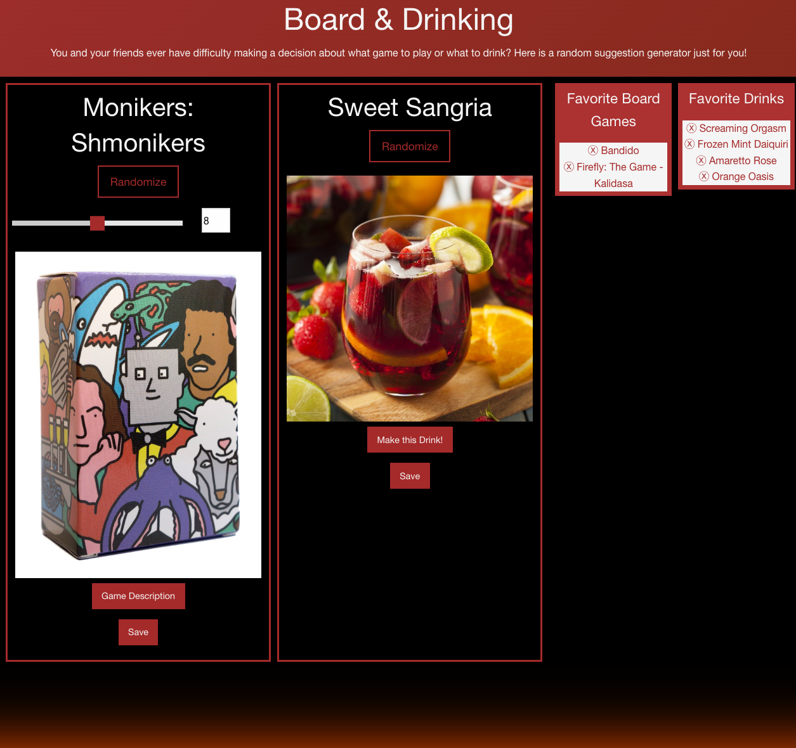

# Board & Booze

## Description

Users are able to randomly generate a board game and drink suggestions and save favorite suggestions to view again

## Installation

Web Page was deployed using GitHub pages.
Deployed Page Link: https://sdanimc.github.io/shire-board-game/ 

### Usage

Within the board game section, users are presented with a slider allowing them to indicate the number of players for a game. Users click the Randomize button within either the board game or drink box to randomly generate a suggestion for the respective category. Random generated suggestions appear in their respective cards with a title, picture, and save button. Additionally, when a board game suggestion is generated, a description button will appear that, on clicking, will present the user with a description of the game in a modal. Similarly, within the Drink card, a "Make this Drink" button will appear upon suggestion generation and when clicked the user will be provided a modal with ingredients and directions for making the drink. 

Users can click the save button at the bottom of the card to save a favorite suggestion to the respective list on the right side of the page. Clicking a saved favorite from the favorites list will repopulate the suggestion information in the respective card. Users can generate a new suggestion with the Randomize button at the top of the card at any time. Users can also clear out a specific favorites entry by clicking on the ⓧ button next to the entry.

### Credits

- Coded by S. D. McMillan, Bryan Smith, Armond Vicencio, Mony Sary, Andrei Skorodumov, Nate Difiori
- API: TheCocktailDB & Board Game Atlas
- CSS Framework: Foundation
- Banner Pen: Manuel Pinto https://manuel.pinto.dev